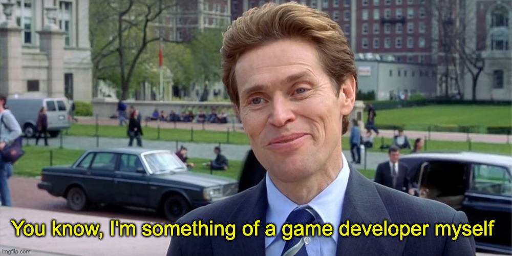

# What's that? 🤔
This, my friend, is ~a pint~ a project I've created in school (actually after school).

My first real, fully functional game written in Deplhi 7.

I was quite a computer genius myself. Back then computers were not rare, but 14 years old kind coding games was very rare, to say the least.

I wanted to create a game and tried few times.

I took a demo-game from Delphi demos and changed colour, claimed it's mine! BS was called and I admitted that it was not really my game.

It took me a few years to improve and I did it!

# Some technical stuff
I wasn't good in programming, I didn't knew how to use resources – so I've placed all the images on the hidden window and just reused them 😂

It was a super-primitive game and trivial implementation.

I painted all the images, background and spaceship models.

I was proud of myself and you know – I'm still proud of that kid.

## Footnote
Project name was "Star Wars" originally. Never knew about any copyrights back then.

I have to change it a bit, but just in case – no copyrights infringement intended.